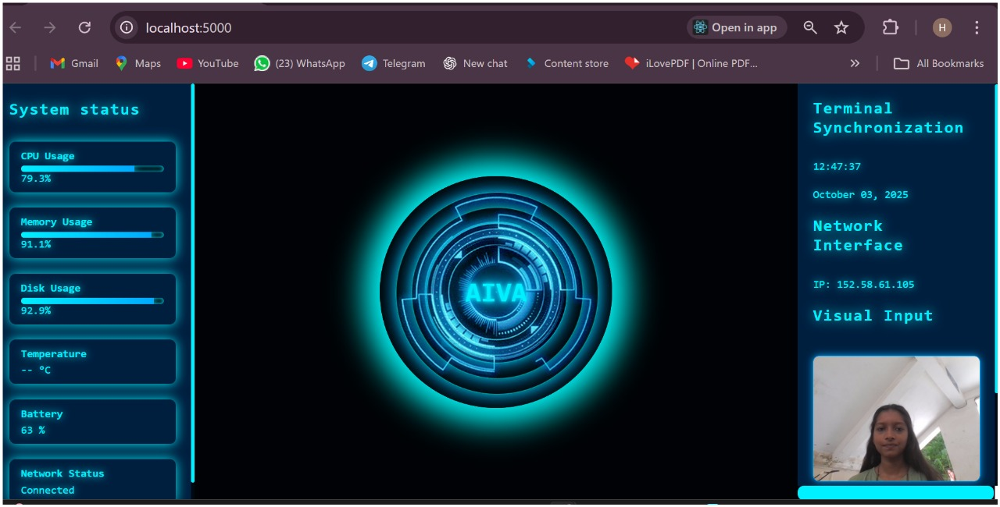

# AIVA - AI Voice Assistant Desktop Application

## Overview

AIVA (Artificial Intelligence Voice Assistant) is a Python-based desktop voice assistant that performs various tasks through voice commands. It helps users interact with their computer hands-free by opening applications, searching the web, controlling system functions, and providing useful information using speech recognition and text-to-speech technologies.

## Features

### Application Control

* Open Google Chrome
* Open Notepad
* Open Gmail
* Open WhatsApp
* Launch other desktop applications

### Web Services

* Google Search
* YouTube Search
* Wikipedia Search
* Fetch information from the internet

### System Control

* Volume Control
* Take Screenshots
* Switch Tabs
* Shutdown System
* Restart System
* Other desktop automation tasks

### AI-Powered Interaction

* Speech Recognition
* Text-to-Speech Responses
* Voice Command Processing
* Natural User Interaction

## Technologies Used

* Python
* SpeechRecognition
* pyttsx3
* pyautogui
* webbrowser
* Wikipedia API
* Operating System Libraries
* Machine Learning Concepts


## Screenshots

### Home Screen


## Demo Videos

- [AIVA Demo 1](screenshots/22-git.mp4)
- [AIVA Demo 2](screenshots/22-git.mp4)


## Project Structure

```
AIVA/
│
├── main.py
├── assistant.py
├── commands.py
├── requirements.txt
├── assets/
├── screenshots/
└── README.md
```

## Installation

### Prerequisites

* Python 3.8 or higher
* Microphone
* Internet Connection

### Steps

1. Clone the repository:

```bash
git clone https://github.com/YOUR_USERNAME/AIVA-Desktop-Assistant.git
```

2. Navigate to the project directory:

```bash
cd AIVA-Desktop-Assistant
```

3. Install required dependencies:

```bash
pip install -r requirements.txt
```

4. Run the application:

```bash
python main.py
```

## Example Commands

* "Open Chrome"
* "Search Python tutorials on Google"
* "Open YouTube"
* "Who is Elon Musk?"
* "Take a screenshot"
* "Increase volume"
* "Shutdown computer"

## Future Enhancements

* AI Chat Integration
* Weather Updates
* Email Automation
* Calendar Management
* Face Recognition
* Smart Home Integration
* Advanced Machine Learning Features

## Learning Outcomes

Through this project, we learned:

* Python Programming
* Speech Recognition Systems
* Desktop Automation
* API Integration
* Human-Computer Interaction
* AI Assistant Development
* Software Project Management

## Contributors

* Hiral Sathwara
* Uchit vyas

## License

This project is developed for educational and learning purposes.

## Acknowledgements

Special thanks to the open-source Python community and various libraries that made this project possible.
